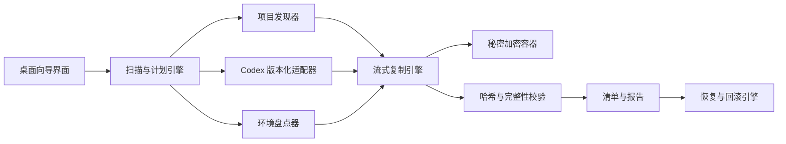

# Codex 一键备份与换机迁移工具项目需求手册

## 0. 文档信息

| 项目 | 内容 |
| --- | --- |
| 文档版本 | 0.1 |
| 文档状态 | 需求草案 |
| 更新日期 | 2026-06-17 |
| 目标平台 | Windows 10/11 x64 |
| 默认语言 | 简体中文 |
| 主要用途 | Codex 项目、对话及个人开发环境的本地备份和换机迁移 |

### 0.1 需求级别

- `P0`：不满足则不得发布。
- `P1`：首个稳定版本应完成。
- `P2`：增强能力，可在后续版本实现。

### 0.2 文档用词

- “必须”表示强制要求。
- “应”表示默认要求，除非有充分理由才可偏离。
- “可”表示可选能力。
- “源电脑”指导出备份的旧电脑。
- “目标电脑”指导入备份的新电脑。
- “原生快照”指对 Codex 本地状态的冻结副本。
- “通用备份”指不依赖 Codex 内部格式的项目、文本、清单和报告。

---

## 1. 项目背景

用户长期在一台电脑上使用 Codex 创建多个项目。项目源码、Git 历史、未提交修改、数据库、模型文件、Codex 对话、规则、技能、插件及个人配置分散保存。换机、系统损坏或硬盘故障时，容易因遗漏关键文件而中断项目。

本项目将制作一个独立 Windows 桌面软件，将分散数据导出到移动硬盘、NAS 或其他用户指定位置，并在新电脑上完成校验、路径映射、恢复与结果报告。

### 1.1 已知现状

- 目标用户可能拥有多个本地 Git 项目，其中一部分可能没有远程仓库。
- 部分项目可能存在未提交变更。
- Codex 本地目录包含会话、已归档会话、状态数据库、日志、记忆、技能、插件和生成资源。
- 多个盘符可能位于同一块物理硬盘，盘符间复制不能代替外部备份。
- Codex 会话文件通常能提供高价值工作路径，但不能保证覆盖全部项目，仍需要项目标志补漏和用户确认。
- Codex 会话中的 `cwd` 是会话工作目录，不是一份保证完整的“全部项目注册表”。

---

## 2. 产品定位

### 2.1 产品愿景

让普通用户在不理解 Codex 内部目录、Git 或数据库结构的情况下，也能可视化地完成“扫描、导出、校验、导入、验收”全流程。

### 2.2 核心承诺

1. 对可复制的项目文件提供可校验的完整恢复。
2. 对 Codex 内部状态提供尽最大可能的原生恢复，但明确显示兼容性边界。
3. 同时生成不依赖 Codex 内部格式的通用备份，保证未来仍可阅读和继续开发。
4. 导出和导入过程不修改源项目，不自动 Git 提交，不删除用户数据。
5. 任何“已成功”状态都必须有校验证据，不得只以复制进程结束作为成功标准。

### 2.3 非目标

- 不尝试绕过 Codex、OpenAI 或第三方服务的登录与授权机制。
- 不承诺复制旧电脑的登录令牌、浏览器 Cookie、连接器授权或组织权限。
- 不取代专业的整机镜像、操作系统灾备或云端 Git 托管。
- 不保证在任意未来 Codex 版本中原样恢复未公开的内部数据格式。
- 不默认将私密源码或凭据上传至任何云端。

---

## 3. 用户与使用场景

### 3.1 目标用户

- 主要用户：在 Windows 上长期使用 Codex 制作个人软件和本地项目的用户。
- 次要用户：希望为多台开发电脑建立离线迁移包的开发者。

### 3.2 核心场景

| 场景 | 说明 | 优先级 |
| --- | --- | --- |
| 换机迁移 | 旧电脑导出到移动硬盘，新电脑导入 | P0 |
| 智能项目发现 | 优先使用 Codex 记录，轻量扫描项目标志补漏 | P0 |
| 定期备份 | 对项目和 Codex 数据执行新快照 | P1 |
| 灾难恢复 | 从完整备份包恢复到空白电脑 | P0 |
| 单项目恢复 | 只恢复某一项目及相关会话 | P1 |
| 会话查阅 | 原生会话不兼容时仍可查阅通用导出 | P0 |
| 完整性检查 | 对既有备份包执行只读校验 | P0 |
| 备份浏览 | 在不恢复的情况下查看包内容 | P1 |

---

## 4. 设计原则

1. **双轨保护**：原生快照用于尽可能还原，通用备份用于长期可读。
2. **先校验后宣告成功**：所有 P0 备份都必须生成哈希并完成校验。
3. **源数据只读**：扫描和导出不得修改项目、Git 索引或 Codex 数据。
4. **恢复可回滚**：覆盖目标电脑任何数据前必须建立恢复点。
5. **密钥与数据分离**：登录令牌不默认迁移，秘密数据必须单独加密。
6. **可观察**：每一个遗漏、跳过、冲突和错误都必须可在报告中定位。
7. **不伪造安全感**：不得把同物理磁盘、未校验副本或不兼容的会话标记为“完全安全”。
8. **版本化**：备份格式、Codex 适配器和迁移策略都必须有明确版本。

---

## 5. 数据范围与恢复等级

### 5.1 恢复等级

| 等级 | 名称 | 定义 |
| --- | --- | --- |
| R1 | 可验证完整恢复 | 源和目标文件可通过哈希及元数据比对 |
| R2 | 原生最佳努力恢复 | 依赖 Codex 版本、内部格式或索引，需导入后检查 |
| R3 | 可重建 | 保存清单和配置，在新电脑重新安装或授权 |
| R4 | 不迁移 | 高风险、机器绑定或可重生的临时数据 |

### 5.2 数据分类矩阵

| 类别 | 代表内容 | 默认策略 | 恢复等级 |
| --- | --- | --- | --- |
| 项目工作树 | 源码、文档、资源、未跟踪文件 | 包含 | R1 |
| Git 数据 | `.git`、分支、标签、本地提交 | 包含 | R1 |
| 项目运行数据 | SQLite、上传文件、生成成果 | 包含并提醒一致性 | R1/R2 |
| 模型与数据集 | 权重、训练数据、音频、标注 | 包含，单独显示大小 | R1 |
| Codex 会话 | `sessions`、已归档会话 | 原生快照+通用导出 | R2+R1 |
| Codex 状态 | 索引、SQLite、全局状态、记忆 | 原生快照 | R2 |
| 持久规则 | `AGENTS.md`、rules、skills、个人配置 | 包含 | R1/R2 |
| 自定义插件 | 自己制作或手动安装的插件 | 包含源文件和清单 | R1/R3 |
| 官方插件缓存 | 可重新下载的缓存 | 默认不包含 | R3 |
| MCP/Connector | 配置、端点、依赖清单 | 备份配置，新机重授权 | R2/R3 |
| 开发环境 | 软件、版本、扩展、环境变量名 | 生成清单 | R3 |
| 用户秘密 | `.env`、API Key、证书 | 仅在用户选择后加密备份 | R1/R3 |
| 登录与机器凭据 | Codex 令牌、Cookie、系统凭据 | 不迁移 | R4 |
| 临时数据 | cache、tmp、sandbox、运行时锁文件 | 默认不包含 | R4 |

### 5.3 Codex 兼容性边界

- Codex 本地内部格式不应被视为永久稳定的公开接口。
- 软件必须将 Codex 快照处理实现为可版本化适配器，不得把路径和数据库表结构散布在界面代码中。
- 导入前必须识别源端和目标端 Codex 版本及快照结构。
- 无可用适配器时，必须禁止“无提示覆盖”，但允许恢复项目和通用对话导出。

---

## 6. 备份包规范

### 6.1 默认目录结构

```text
CodexBackup_<timestamp>_<backup-id>/
├─ manifest.json
├─ projects/
├─ codex-native-snapshot/
├─ conversations-portable/
├─ skills-rules-plugins/
├─ environment/
├─ secrets/
│  └─ encrypted-secrets.vault
├─ reports/
│  ├─ export-report.html
│  ├─ export-report.json
│  └─ git-status/
├─ checksums/
│  └─ sha256.txt
└─ README_RESTORE.md
```

### 6.2 格式要求

- `PKG-001 P0`：每个备份必须有唯一 `backup-id`、创建时间、源机器非敏感标识和格式版本。
- `PKG-002 P0`：清单必须记录文件相对路径、大小、修改时间、哈希、数据类别和恢复等级。
- `PKG-003 P0`：备份包内部不得依赖源电脑的绝对路径。旧绝对路径只能作为元数据保存。
- `PKG-004 P0`：必须支持中文、空格、长路径和 Unicode 文件名。
- `PKG-005 P0`：必须识别并阻断目录穿越路径，导入时任何文件不得写出用户选定的目标根目录。
- `PKG-006 P1`：大型备份应支持分块、断点续传或可恢复的临时状态。
- `PKG-007 P1`：备份包应能被软件只读浏览，不得要求先导入。
- `PKG-008 P1`：软件应为备份格式提供向后兼容或明确的格式升级流程。

---

## 7. 功能需求

### 7.1 扫描与盘点

- `SCAN-001 P0`：自动定位当前用户的 Codex 数据根目录，不得只写死单一用户名路径。
- `SCAN-002 P0`：扫描 Codex 会话、归档、状态、记忆、配置、规则、技能、插件及生成资源。
- `SCAN-003 P0`：必须首先从 Codex 会话、状态和历史索引中提取已记录的工作路径，将其作为项目发现的主要来源。
- `SCAN-004 P0`：允许用户手动增加任意项目或资料目录。
- `SCAN-005 P0`：项目列表必须显示路径、估算大小、Git 状态、远程仓库有无、大文件和潜在秘密。
- `SCAN-006 P0`：扫描连接点、符号链接和目录连接时必须防止循环遍历。
- `SCAN-007 P1`：为每项数据标记“可完整恢复”、“最佳努力”、“需重装”或“不迁移”。
- `SCAN-008 P1`：允许将用户确认的项目根目录保存为下次扫描默认值。
- `SCAN-009 P0`：对 Codex 记录路径必须向上解析 `.git`、`package.json`、`pyproject.toml`、`.sln` 等标志，确定真正项目根目录。
- `SCAN-010 P0`：必须执行轻量补漏扫描，仅检查用户目录、已确认项目根目录和挂载固定磁盘中的项目标志，不得为了发现项目而读取源码内容。
- `SCAN-011 P0`：默认跳过 Windows、Program Files、ProgramData、系统恢复区、依赖缓存和其他明确非项目目录；如 Codex 记录明确指向这些位置，则单独检查该路径。
- `SCAN-012 P0`：项目列表必须标记发现来源：Codex 记录、项目标志补漏或用户手动添加。
- `SCAN-013 P0`：Codex 记录中的路径已失效、被移动或无法访问时，必须显示警告并尝试按项目名和标志定位，不得静默忽略。
- `SCAN-014 P0`：扫描结束时必须让用户查看并确认最终项目清单，但不要求用户理解技术目录结构。

### 7.2 导出前检查

- `PRE-001 P0`：检测 Codex 及相关数据库是否正在使用。执行原生快照前必须提示用户退出 Codex。
- `PRE-002 P0`：必须显示源数据大小、目标可用空间、预估额外临时空间和安全余量。
- `PRE-003 P0`：目标空间不足时不得启动导出。
- `PRE-004 P0`：检测源盘和目标盘是否属于同一物理磁盘。同盘时必须明确警告“不能防护物理硬盘故障”。
- `PRE-005 P0`：检查目标文件系统是否支持大文件、长路径和必要的文件名。
- `PRE-006 P0`：在开始前显示最终包含、排除和风险项摘要，由用户明确确认。
- `PRE-007 P1`：可选执行快速读取测试，提前发现移动硬盘不稳定或写入速度异常。

### 7.3 项目导出

- `PROJ-001 P0`：必须复制完整项目工作树，包括 `.git`、未提交文件和未跟踪文件。
- `PROJ-002 P0`：不得自动提交、暂存、清理、重置或修改 Git 仓库。
- `PROJ-003 P0`：为每个 Git 仓库生成只读状态报告，包含当前分支、未提交项数、未跟踪项数、分支及标签摘要。
- `PROJ-004 P0`：默认排除项必须先按“可重建”原则分类，不得仅因体积大而排除模型、数据库、数据集或用户产出。
- `PROJ-005 P0`：用户必须能查看、取消或添加排除项。
- `PROJ-006 P1`：可为 Git 仓库附加生成 `git bundle`，但必须明确标注其不包含未提交工作树。
- `PROJ-007 P1`：支持项目级别的自定义包含/排除规则，并在报告中记录规则来源。

### 7.4 Codex 数据导出

- `CODEX-001 P0`：在 Codex 已退出后创建原生快照，保留目录层次、文件时间和所需数据库边车文件。
- `CODEX-002 P0`：必须包含会话、已归档会话、状态、索引、记忆、规则、技能、用户配置和自定义插件。
- `CODEX-003 P0`：默认不包含登录令牌、浏览器会话、机器绑定凭据、sandbox secrets 和可重建缓存。
- `CODEX-004 P0`：必须记录源 Codex 版本、发现到的存储结构版本和适配器版本。
- `CODEX-005 P0`：必须将可解析的对话另外导出为带时间、项目关联和消息角色的通用格式。
- `CODEX-006 P0`：通用对话导出失败不得阻止原始会话文件快照，但必须标记部分成功。
- `CODEX-007 P1`：应能按项目路径建立对话与项目的关联索引。
- `CODEX-008 P1`：应为每个项目生成一份便于 Codex 重新阅读的上下文摘要，但必须与原始对话明确区分。
- `CODEX-009 P2`：支持仅导出指定项目相关会话的轻量包。

### 7.5 开发环境导出

- `ENV-001 P0`：生成操作系统版本、硬件架构、Codex 版本和 Git 版本清单。
- `ENV-002 P1`：生成已安装软件清单，尽可能包含包管理器标识。
- `ENV-003 P1`：生成 Node.js、Python、Java、.NET、Rust、Go 等已检测开发环境的版本清单。
- `ENV-004 P1`：生成编辑器扩展、全局工具和项目依赖锁文件索引。
- `ENV-005 P0`：环境变量默认只记录名称，值必须经用户单独选择后才能进入加密秘密包。
- `ENV-006 P1`：应生成人类可读的新机安装清单，区分“必需”、“项目需要”和“可选”。

### 7.6 安全与加密

- `SEC-001 P0`：必须在扫描阶段识别常见秘密文件和高风险文件名，但不得将完整秘密写入日志。
- `SEC-002 P0`：凭据、`.env`、证书和私钥只能进入独立加密容器，不得混入明文报告。
- `SEC-003 P0`：加密必须使用成熟、经审查的认证加密方案和密码派生方法，不得自行设计加密算法。
- `SEC-004 P0`：密码不得写入备份包、配置、日志或崩溃报告。
- `SEC-005 P0`：必须在用户输入加密密码后显示丢失密码将无法恢复的明确警告。
- `SEC-006 P0`：导入前必须验证备份包清单、哈希和加密完整性，已篡改内容不得静默导入。
- `SEC-007 P1`：软件应提供“可分享报告”选项，对用户名、绝对路径、远程地址和邮箱进行脱敏。
- `SEC-008 P1`：备份包如包含私密源码但没有整包加密，必须在导出结束页持续显示风险提示。

### 7.7 复制、进度和中断处理

- `COPY-001 P0`：复制必须使用流式读写，不得将大文件整体载入内存。
- `COPY-002 P0`：界面必须显示当前项、完成数/总数、已处理字节、速度、预计剩余时间和当前阶段。
- `COPY-003 P0`：取消操作必须可控，软件应先完成当前块写入并将快照标记为未完成。
- `COPY-004 P0`：移动硬盘被拔出、掉线或写入失败时，不得将备份标记为成功。
- `COPY-005 P0`：必须保留可定位的中断状态，下次启动时允许安全重试或清理未完成包。
- `COPY-006 P1`：应支持从已校验块继续复制，避免大型备份全部重来。
- `COPY-007 P0`：连续重试必须有上限，失败文件必须列入报告，不得无限循环。

### 7.8 完整性校验

- `VERIFY-001 P0`：默认使用 SHA-256 或安全性不低于它的哈希算法记录文件完整性。
- `VERIFY-002 P0`：导出完成后必须重新从目标介质读取并校验，不得只校验内存中的源数据。
- `VERIFY-003 P0`：任一 P0 文件缺失或哈希不一致时，总结果必须为失败或部分成功。
- `VERIFY-004 P0`：必须提供独立的“校验现有备份”功能，该功能不修改备份。
- `VERIFY-005 P1`：应支持快速校验和完整校验，但只有完整校验可作为换机备份验收依据。

### 7.9 导入与恢复

- `RESTORE-001 P0`：导入程序必须先完整校验备份包。
- `RESTORE-002 P0`：必须让用户选择项目恢复根目录，并生成“旧路径 -> 新路径”映射。
- `RESTORE-003 P0`：必须在导入 Codex 原生数据前提示安装、启动并登录 Codex，随后完全退出 Codex。
- `RESTORE-004 P0`：必须在修改目标电脑 Codex 数据前建立本地回滚快照。
- `RESTORE-005 P0`：必须默认保留目标电脑的新登录凭据和机器识别信息，不得使用旧机凭据覆盖。
- `RESTORE-006 P0`：遇到现有项目或 Codex 数据冲突时，必须提供跳过、另存、合并或替换的明确选项，默认不破坏现有数据。
- `RESTORE-007 P0`：对不兼容的 Codex 原生快照，必须允许只恢复项目、规则、技能和通用对话。
- `RESTORE-008 P0`：导入完成后必须执行目标文件哈希校验、Git 状态比对和关键目录存在性检查。
- `RESTORE-009 P0`：导入失败时必须能使用回滚快照恢复导入前状态。
- `RESTORE-010 P1`：应允许用户选择性恢复单个项目、单类配置或指定会话。
- `RESTORE-011 P1`：应支持生成旧路径兼容建议，但创建目录连接或管理员级变更前必须单独确认。

### 7.10 报告与审计

- `REPORT-001 P0`：每次导出、校验和导入都必须生成机器可读 JSON 报告和人类可读 HTML 报告。
- `REPORT-002 P0`：报告必须列出总数据量、文件数、成功数、跳过数、失败数、风险项和校验结果。
- `REPORT-003 P0`：报告必须区分成功、部分成功、失败和用户取消。
- `REPORT-004 P0`：失败项必须包含阶段、相对路径、错误码、可重试性和建议操作。
- `REPORT-005 P0`：日志不得包含密码、完整令牌、私钥或 `.env` 完整内容。
- `REPORT-006 P1`：界面应允许从历史记录中查看过去的备份、校验和导入结果。

### 7.11 备份模式

- `MODE-001 P0`：“换机完整导出”必须包含所有选定项目、Codex 双轨数据、环境清单和完整校验。
- `MODE-002 P1`：“日常快照”应支持增量处理，但任何快照必须可独立计算恢复所需数据。
- `MODE-003 P1`：“项目导出”应支持只导出指定项目及关联会话。
- `MODE-004 P0`：“只读校验”必须能对移动介质上的备份包独立执行。

---

## 8. 用户交互要求

### 8.1 首页

首页必须提供四个清晰入口：

1. 导出完整迁移包。
2. 恢复到新电脑。
3. 校验现有备份。
4. 查看备份内容和历史报告。

### 8.2 导出向导

1. 扫描电脑。
2. 选择项目和数据。
3. 处理大文件、排除项和秘密。
4. 选择目标位置。
5. 导出前检查。
6. 执行复制和校验。
7. 展示结果和恢复说明。

### 8.3 导入向导

1. 选择备份包。
2. 验证完整性和密码。
3. 检测新电脑环境。
4. 选择恢复内容和路径映射。
5. 处理冲突与 Codex 版本风险。
6. 创建回滚快照。
7. 执行恢复和验收。
8. 显示待重装、待登录和待授权清单。

### 8.4 交互通用要求

- `UI-001 P0`：不得只显示“成功”，必须显示校验范围和未包含内容。
- `UI-002 P0`：破坏性操作、覆盖、忽略哈希错误和跳过回滚必须二次确认。
- `UI-003 P0`：专业术语必须有简明解释，错误提示必须给出可执行的下一步。
- `UI-004 P1`：支持 Windows 高 DPI、系统缩放和深色/浅色模式。
- `UI-005 P1`：所有核心操作可使用键盘完成，关键状态不得只依赖颜色表达。
- `UI-006 P1`：界面长时间处理时必须保持响应，并允许打开当前日志或查看详细信息。

---

## 9. 非功能需求

### 9.1 可靠性

- `NFR-REL-001 P0`：导出和导入必须使用“计划、执行、校验、提交”阶段模型，未通过校验的结果不得进入已完成状态。
- `NFR-REL-002 P0`：断电、进程崩溃、强制取消或外置盘掉线后，已存在的完整备份不得被破坏。
- `NFR-REL-003 P0`：软件必须能区分源文件变化、复制失败和目标校验失败。
- `NFR-REL-004 P1`：同一备份包重复校验应得到确定性结果，除非媒介内容已变化。

### 9.2 性能与规模

- `NFR-PERF-001 P0`：必须能处理至少 100 万个文件和单文件超过 100 GB 的备份场景，不得依赖内存容纳完整清单或单文件。
- `NFR-PERF-002 P0`：默认并发数必须保守，不得因追求速度使移动硬盘频繁随机读写或使界面失去响应。
- `NFR-PERF-003 P1`：应记录扫描、复制、哈希和报告各阶段耗时，用于后续优化。

### 9.3 可维护性

- `NFR-MAINT-001 P0`：Codex 存储发现、导出和恢复必须与通用文件备份引擎解耦。
- `NFR-MAINT-002 P0`：备份格式和适配器必须有独立测试数据与版本迁移测试。
- `NFR-MAINT-003 P1`：排除规则、项目识别规则和敏感文件规则应可数据化更新，不应全部写死在界面代码中。

### 9.4 可移植性与部署

- `NFR-DEPLOY-001 P0`：发布产物必须是用户可直接启动的 Windows 应用，无需手动安装编程语言运行环境。
- `NFR-DEPLOY-002 P0`：导入程序必须能与备份包一同放入移动硬盘，便于在新电脑运行。
- `NFR-DEPLOY-003 P1`：应支持单文件便携版和标准安装版，两者使用相同备份格式。
- `NFR-DEPLOY-004 P1`：应保存应用版本、构建版本和签名信息，报告中可追溯生成备份的程序版本。

---

## 10. 建议系统结构



### 10.1 模块职责

| 模块 | 职责 |
| --- | --- |
| 扫描与计划引擎 | 生成确定的包含/排除计划，估算空间与风险 |
| 项目发现器 | 识别 Git 仓库、项目标记、数据库和大资源 |
| Codex 适配器 | 封装 Codex 路径、格式、会话导出和恢复兼容性 |
| 环境盘点器 | 生成软件、运行时、扩展和重装清单 |
| 复制引擎 | 流式复制、重试、取消、断点状态和媒介异常处理 |
| 加密容器 | 存储用户明确选择的凭据和秘密 |
| 校验引擎 | 生成并从目标重读验证哈希 |
| 报告引擎 | 生成 JSON/HTML 结果、风险和恢复说明 |
| 恢复引擎 | 路径映射、冲突处理、回滚快照、导入及验收 |

---

## 11. 错误处理

### 11.1 标准结果状态

- `Success`：所有选定 P0 数据均已处理且完整校验通过。
- `PartialSuccess`：主体数据已处理，但存在跳过、不支持或失败项。
- `Failed`：清单、核心数据、写入或校验失败。
- `Cancelled`：用户取消，生成未完成标记，不得显示为成功。
- `RolledBack`：导入失败后已恢复导入前状态。

### 11.2 必须覆盖的异常

- Codex 未退出或 SQLite 处于写入状态。
- 移动硬盘被拔出、盘符改变或进入只读状态。
- 目标空间耗尽。
- 文件被占用、权限不足或路径过长。
- 源文件在复制期间变化。
- 备份包清单缺失、被篡改或格式版本不支持。
- 加密密码错误或密文完整性验证失败。
- 项目目标路径已存在不同文件。
- 目标 Codex 版本或存储格式不兼容。
- 回滚快照创建失败。
- 防病毒软件拦截、隔离或延迟访问。

---

## 12. 测试要求

### 12.1 测试类型

- 单元测试：路径、排除规则、清单、哈希、冲突策略和版本判定。
- 集成测试：扫描、复制、加密、校验、恢复和回滚。
- 兼容测试：Windows 版本、文件系统、Codex 快照版本和不同用户路径。
- 故障注入：拔盘、断电模拟、空间耗尽、锁文件、权限拒绝和哈希篡改。
- 性能测试：大文件、百万小文件、低速移动盘和长时间运行。
- 安全测试：目录穿越、恶意清单、错误密码、日志泄密和加密完整性。
- 可用性测试：非技术用户能否完成全流程，能否理解风险和结果。

### 12.2 必测数据集

| 数据集 | 覆盖内容 |
| --- | --- |
| 空环境 | 无 Codex 数据、无项目 |
| 典型环境 | 多个项目、会话、规则和插件 |
| 典型风险模型 | 多个 Git 项目、部分脏工作树、远程仓库不完整 |
| Unicode 路径 | 中文、空格、长路径和表情符号文件名 |
| 大文件 | 超大模型、数据库和视频 |
| 大量小文件 | 依赖缓存和生成资源 |
| 连接路径 | 符号链接、目录联接、循环链接 |
| 敏感数据 | `.env`、私钥、令牌形式文本和证书 |
| 不兼容 Codex 快照 | 旧格式、未知格式、部分损坏数据库 |
| 故障介质 | 掉线、空间不足、哈希错误、只读文件系统 |

---

## 13. 验收标准

### 13.1 P0 发布门槛

1. 在标准测试数据集中，项目文件恢复后 SHA-256 一致率必须为 100%。
2. Git 仓库恢复后，分支、标签、提交对象、已跟踪修改和未跟踪文件必须与源报告匹配。
3. 原生 Codex 快照必须可完整导出、校验和回滚；原生导入兼容性不确定时必须安全降级。
4. 对话必须同时存在原始快照和人类可读的通用导出，无法解析项必须列入报告。
5. 从导出开始到完成校验，源项目和 Git 状态不得因工具而发生变化。
6. 目标盘掉线、空间耗尽和进程中断后，不得出现被标记为完成的不完整备份。
7. 导入前回滚快照必须经过实际回滚测试。
8. 日志和报告的秘密扫描测试必须通过，不得出现完整令牌、密码或私钥。
9. 无法支持的 Codex 版本必须被明确拦截或降级，不得静默尝试破坏性覆盖。
10. 发布包必须在一台未安装开发环境的支持版 Windows 电脑上完成导出、校验和导入全流程。

### 13.2 成功指标

- 用户可在不手动寻找 `.codex` 或 Git 内部文件的情况下完成迁移。
- 每个备份均能回答“备份了什么、没备份什么、哪些可完整恢复、哪些需要重装”。
- 即使 Codex 原生数据无法导入，用户仍能恢复项目、Git 数据、规则、技能和可读对话。

---

## 14. 版本规划

### 14.1 阶段 A：发现与风险验证

- 只读扫描 Codex 数据和项目。
- 生成数据分类、大小、Git 状态和秘密风险报告。
- 建立 Codex 存储适配器的测试样本。

### 14.2 阶段 B：可验证导出 MVP

- 桌面向导。
- 项目和 Codex 原生快照。
- 通用对话导出。
- SHA-256 完整校验。
- JSON/HTML 报告。
- 不处理登录凭据。

### 14.3 阶段 C：安全导入 MVP

- 项目路径映射。
- 导入前回滚快照。
- 项目、Git、规则、技能和通用对话恢复。
- 已支持 Codex 版本的原生状态导入。
- 导入后验收和回滚。

### 14.4 阶段 D：长期备份

- 增量快照。
- 快照历史、保留策略和独立校验。
- 可选 NAS 目标。
- 定期备份提醒。

### 14.5 阶段 E：增强能力

- 块级去重、分块存储和断点续传。
- 更多 Codex 版本适配器。
- 单项目轻量迁移包。
- 加密备份容器和密钥恢复策略增强。

---

## 15. 风险清单

| 风险 | 影响 | 缓解方案 |
| --- | --- | --- |
| Codex 内部格式变更 | 对话或状态无法原生导入 | 版本适配器+原始快照+通用导出+安全降级 |
| Codex 运行时复制 SQLite | 数据库不一致 | 要求退出、检测锁和边车文件、校验快照 |
| 移动硬盘中途掉线 | 备份不完整 | 临时状态、未完成标记、续传和完整校验 |
| 巨大模型和数据集 | 空间不足、备份缓慢 | 导出前估算、分类显示、不盲目排除、分块处理 |
| 秘密泄露 | 账号或服务被滥用 | 凭据默认排除、秘密单独加密、日志脱敏 |
| 用户误以为同盘副本是安全备份 | 物理盘故障时全部丢失 | 检测物理磁盘并持续警告 |
| 恢复覆盖新电脑数据 | 新数据丢失 | 默认合并/另存、覆盖确认、导入前回滚快照 |
| 旧绝对路径失效 | 会话内文件引用无法打开 | 路径映射、稳定项目根目录建议、兼容路径提示 |
| 密码丢失 | 加密秘密永久无法恢复 | 明确警告、密码二次确认、可选恢复密钥设计 |
| 软件自身损坏备份 | 用户丧失信任 | 源只读、临时包、原子提交、哈希校验、故障注入测试 |

---

## 16. 待决策事项

以下问题不阻塞需求评审，但在技术设计阶段必须决定：

1. 产品正式名称、图标和应用标识。
2. 桌面技术栈及单文件发布方案。
3. 首版是否支持整包加密，还是仅加密 secrets 容器。
4. 首版是否引入分块、压缩和断点续传，或优先完成透明目录备份。
5. 通用对话导出格式是否同时提供 Markdown 与 JSON。
6. Codex 原生导入是否仅开放给通过自动兼容测试的版本组合。
7. 日常增量备份的快照保留数量和清理策略。
8. NAS、网络共享和云同步目录是否列入首个稳定版。

---

## 17. 发布前检查清单

- [ ] 所有 P0 需求已实现并有自动或人工测试证据。
- [ ] 完整换机演练已在独立 Windows 电脑上通过。
- [ ] 项目、Git 工作树和关键资源哈希 100% 匹配。
- [ ] Codex 兼容与不兼容恢复流程均已测试。
- [ ] 拔盘、空间不足、权限拒绝和哈希篡改测试已通过。
- [ ] 导入前回滚与失败后恢复已实际演练。
- [ ] 日志、报告和崩溃信息已通过秘密泄露检查。
- [ ] 备份包格式版本、软件版本和 Codex 适配器版本可追溯。
- [ ] 便携版在未安装开发环境的 Windows 上可正常启动。
- [ ] 用户可以从报告中明确知道哪些已恢复、哪些需重装、哪些需重新授权。

---

## 18. 结论

本产品不应被定义为“把 `.codex` 压缩到移动硬盘”的简单工具，而应定义为一个可校验、可降级、可回滚的 Codex 项目迁移系统。

最重要的产品标准不是“尽可能多复制文件”，而是：

> 在用户需要换机或发生故障时，软件能用可验证的证据告诉用户：哪些内容已完整保护，哪些内容可尽力还原，哪些内容必须重新安装或授权。
